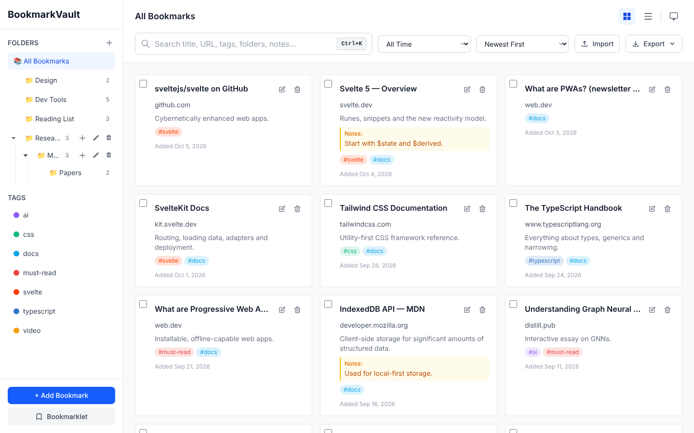
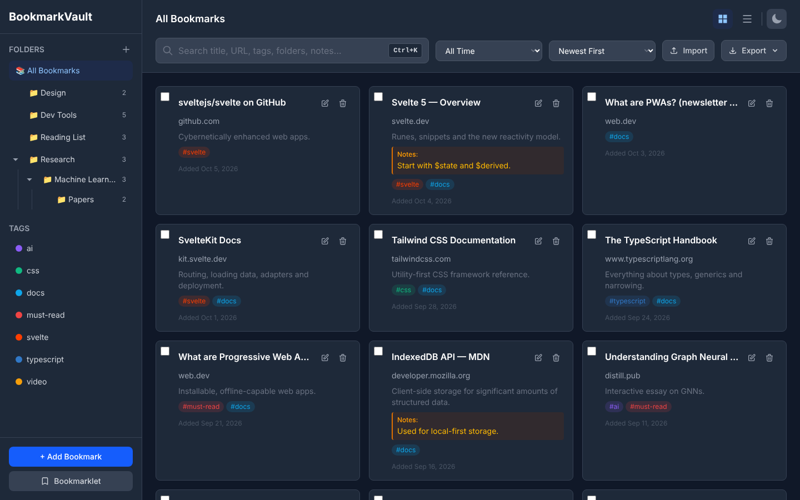
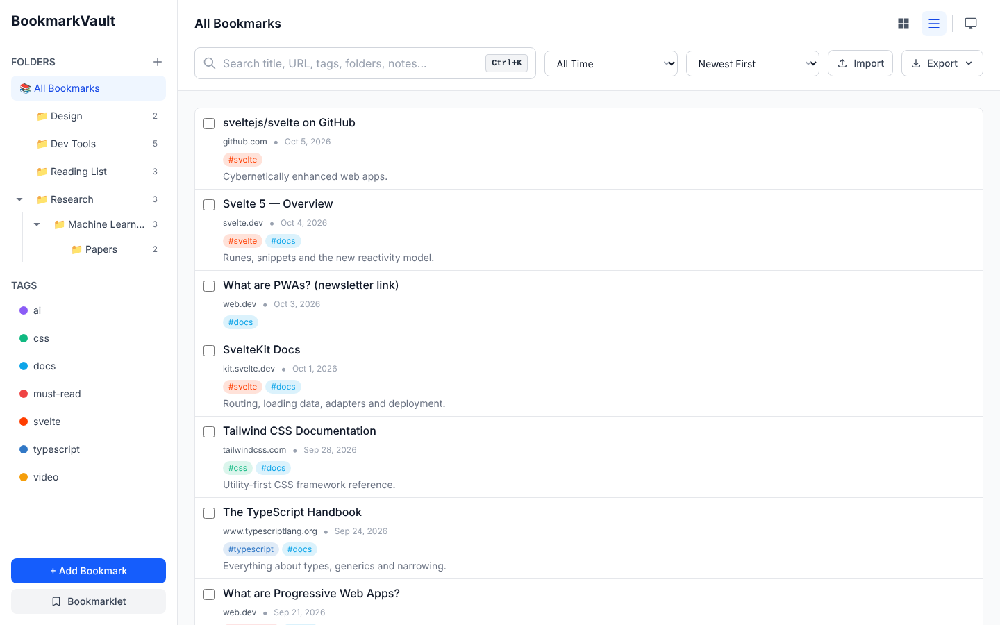
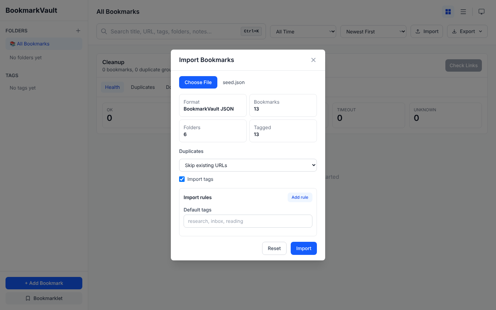
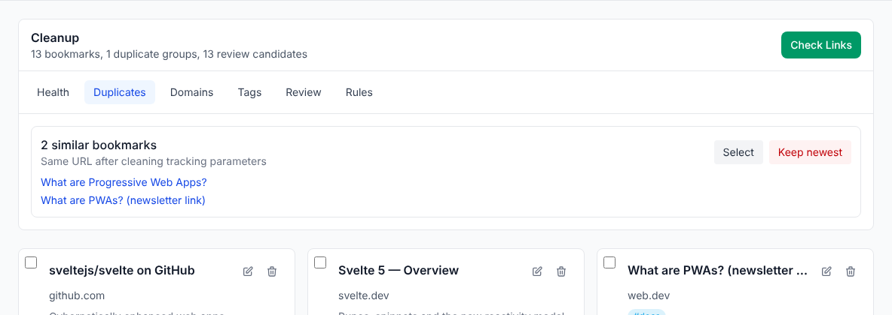
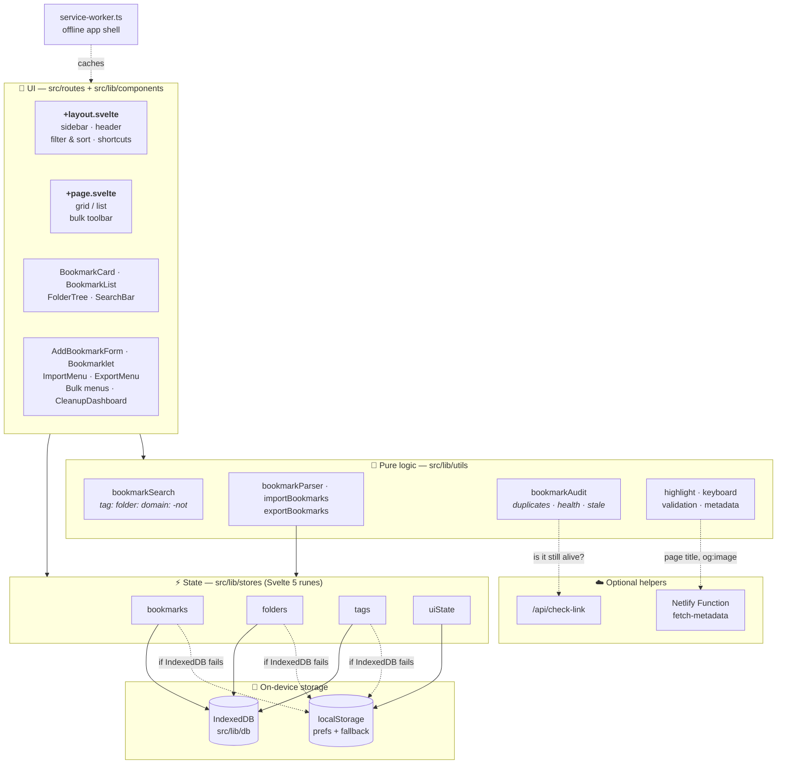
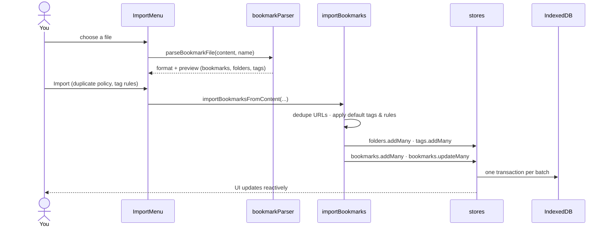

<div align="center">

# 🔖 BookmarkVault

### Your bookmarks. Your browser. Nobody else's server.

A **local-first, offline-ready PWA** bookmark manager built for power users and researchers —
nested folders, color-coded tags, operator-powered search, bulk editing, a cleanup dashboard,
and lossless import/export. Everything lives in **IndexedDB on your device**.

[](https://github.com/chrisbrooksbank/bookmarkmanager/actions/workflows/ci.yml)


</div>

---

## ✨ Why BookmarkVault?

Browser bookmark bars become graveyards. Cloud bookmark services want your account, your data and a
subscription. BookmarkVault is the middle path:

- 🏠 **Local-first** — data never leaves your machine unless _you_ export it. No sign-up, no tracking.
- ✈️ **Works offline** — installable PWA with a service worker; open it on a plane.
- ⚡ **Fast** — Svelte 5 runes and indexed lookups keep thousands of bookmarks snappy.
- 🔁 **No lock-in** — export to browser HTML, JSON or CSV at any time and import it straight back, tags included.

## 📸 Screenshots

<table>
  <tr>
    <td width="50%"></td>
    <td width="50%"></td>
  </tr>
  <tr>
    <td align="center"><b>Grid view</b> — nested folders, colored tags, research notes</td>
    <td align="center"><b>Dark mode</b> — light, dark or follow the system</td>
  </tr>
  <tr>
    <td width="50%"></td>
    <td width="50%"></td>
  </tr>
  <tr>
    <td align="center"><b>List view</b> — dense, scannable rows</td>
    <td align="center"><b>Smart import</b> — format detection, duplicate policy, tag rules</td>
  </tr>
</table>

<p align="center">
  <br/>
  <b>Cleanup dashboard</b> — find duplicates (even behind <code>utm_*</code> tracking junk), dead links and stale saves
</p>

## 🚀 Features

### Organize

| Feature                  | Details                                                                                                 |
| ------------------------ | ------------------------------------------------------------------------------------------------------- |
| 📁 **Nested folders**    | Unlimited depth, inline create / rename / delete, live bookmark counts including subfolders             |
| 🏷️ **Color-coded tags**  | Click a tag in the sidebar _or_ on any card to filter; combine tags with AND logic                      |
| 📝 **Research notes**    | Separate _description_ and personal _notes_ fields — perfect for citations and context                  |
| 🖼️ **Rich previews**     | Title, description, favicon and Open Graph image fetched automatically via a Netlify Function           |
| ✅ **Bulk operations**   | Multi-select, then tag / untag / move / delete in one IndexedDB transaction                             |
| 🧹 **Cleanup dashboard** | Link-health checks, duplicate groups, domain clusters, tag suggestions, a review queue and URL cleaning |

### Find — search with operators

The search bar understands a small query language. Terms are **AND**-ed together and every match is highlighted.

| Query              | Matches                                                            |
| ------------------ | ------------------------------------------------------------------ |
| `svelte runes`     | Anything mentioning both words (title, URL, notes, tags, folders…) |
| `tag:ai`           | Bookmarks tagged `ai` (shorthand: `#ai`)                           |
| `folder:research`  | Anything inside a folder path containing `research`                |
| `domain:arxiv.org` | Bookmarks on a given site                                          |
| `title:"few-shot"` | Quoted phrases inside a specific field                             |
| `notes:citation`   | Also `desc:`, `url:`                                               |
| `-tag:archive`     | Prefix any term with `-` to exclude it                             |

Combine with the **date range** filter (7 / 30 / 90 days) and **sort** (newest, oldest, A→Z, recently updated).

### Move data in and out

| Format                  | Import | Export | Notes                                                          |
| ----------------------- | :----: | :----: | -------------------------------------------------------------- |
| Browser HTML (Netscape) |   ✅   |   ✅   | Chrome, Firefox, Edge, Safari — folders, notes and `TAGS` kept |
| BookmarkVault JSON      |   ✅   |   ✅   | Full fidelity: folders, tags, notes, timestamps, previews      |
| Chrome `Bookmarks` JSON |   ✅   |        | Straight from your Chrome profile folder                       |
| CSV                     |   ✅   |   ✅   | `URL, Title, Folder, Tags, Description, Notes, Created At`     |
| Plain URL list          |   ✅   |        | One URL per line, optional title after it                      |

Imports detect the format automatically, preview what they found, and let you choose how to treat duplicates
(**skip**, **replace** or **keep both**). **Import rules** tag bookmarks on the way in — e.g. _domain is
`arxiv.org` → tag `paper`_. Exports can be scoped to **all**, **filtered** or **selected** bookmarks.

### Capture from anywhere

Drag the **Bookmarklet** to your bookmarks bar. On any page it opens BookmarkVault with the URL, title and
your highlighted text pre-filled.

### ⌨️ Keyboard shortcuts

| Shortcut                         | Action         |
| -------------------------------- | -------------- |
| <kbd>Ctrl/⌘</kbd> + <kbd>K</kbd> | Focus search   |
| <kbd>Ctrl/⌘</kbd> + <kbd>N</kbd> | Add bookmark   |
| <kbd>Ctrl/⌘</kbd> + <kbd>B</kbd> | Toggle sidebar |
| <kbd>Ctrl/⌘</kbd> + <kbd>1</kbd> | Grid view      |
| <kbd>Ctrl/⌘</kbd> + <kbd>2</kbd> | List view      |
| <kbd>Esc</kbd>                   | Close dialogs  |

## 🏗️ Architecture

BookmarkVault is a single-page SvelteKit app. UI components talk to **rune-based stores**, the stores own
all state and persist it through a thin **IndexedDB** wrapper (with a `localStorage` safety net). Pure
utility modules do the heavy lifting for search, parsing and auditing, which keeps them easy to unit-test.



### How an import flows



### Project layout

```text
src/
├── routes/
│   ├── +layout.svelte        # App shell: sidebar, header, filters, modals, shortcuts
│   ├── +page.svelte          # Bookmark grid/list + bulk-selection toolbar
│   └── api/check-link/       # Link-health endpoint used by the cleanup dashboard
├── lib/
│   ├── components/           # UI building blocks (cards, forms, menus, dashboard)
│   ├── stores/               # Reactive state (bookmarks, folders, tags, uiState)
│   ├── db/                   # IndexedDB schema + CRUD helpers
│   ├── utils/                # Search, import/export, audit, metadata, keyboard…
│   └── types/                # Bookmark, Folder, Tag
├── service-worker.ts         # Offline caching
└── tests/                    # Store, route and PWA integration tests
netlify/functions/            # fetch-metadata serverless function
static/                       # PWA manifest + icons
```

## 🛠️ Getting started

**Prerequisites:** Node.js 20+

```bash
git clone https://github.com/chrisbrooksbank/bookmarkmanager.git
cd bookmarkmanager
npm install
npm run dev          # → http://localhost:5173
```

Then hit **Import** and drop in your browser's exported bookmarks file — or just start adding.

### Scripts

| Command            | What it does                                          |
| ------------------ | ----------------------------------------------------- |
| `npm run dev`      | Start the Vite dev server                             |
| `npm run build`    | Production build (Netlify adapter)                    |
| `npm run preview`  | Preview the production build                          |
| `npm test`         | Run the Vitest suite (jsdom + fake-indexeddb)         |
| `npm run check`    | `svelte-check` type checking                          |
| `npm run lint`     | ESLint                                                |
| `npm run format`   | Prettier                                              |
| `npm run validate` | Everything CI runs: format, lint, types, tests, build |

Husky + lint-staged format and lint staged files on every commit.

## ☁️ Deployment

The app deploys to **Netlify** via [`netlify.toml`](netlify.toml) — push to `main` and it ships. The
Netlify Function in `netlify/functions/fetch-metadata.ts` fetches page metadata server-side to dodge CORS;
everything else is static and runs in the browser. Strict security headers (CSP, `X-Frame-Options`,
`nosniff`) are configured in the same file.

## 🔒 Privacy

- Bookmarks, folders and tags are stored **only** in your browser's IndexedDB.
- The only network calls are the ones you trigger: fetching a page's metadata and checking link health.
- Clearing site data removes everything — **export a JSON backup** now and then.

## 🤝 Contributing

Issues and pull requests are welcome! Please run `npm run validate` before opening a PR so CI stays green.

## 📄 License

[MIT](LICENSE) © Chris Brooksbank
